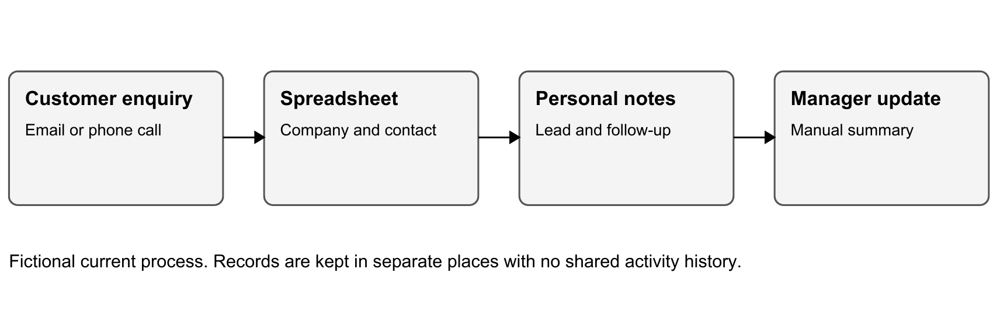
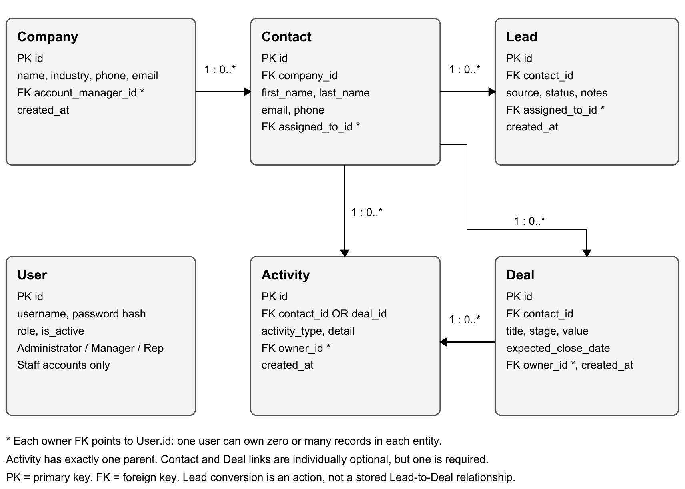
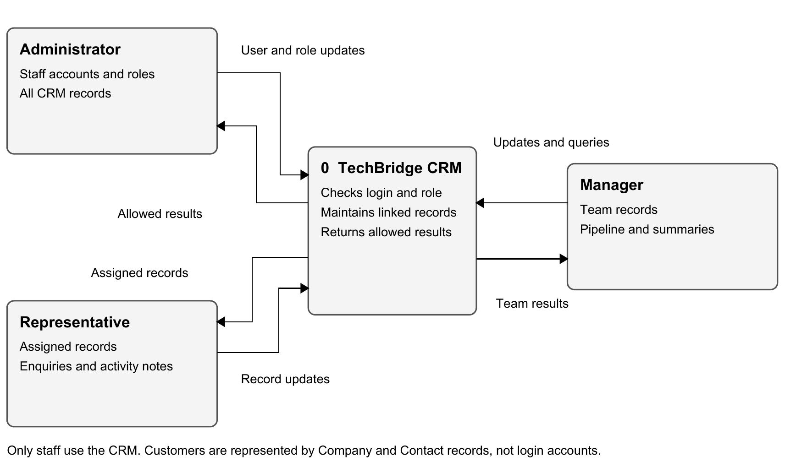

# TechBridge MSP Customer Relationship Management System

Analysis Phase

ITP700 IT Project | Group 28 | Due 9 October 2026

## 3.1 Introduction

This phase looks more closely at the problem described in our proposal and Planning Phase. TechBridge MSP is a made-up small IT support business. It helps other businesses with computers, networks, user accounts, backups and general IT support. The CRM is for the staff who manage customer details and sales follow-ups, rather than for customers to log into themselves.

In the current scenario, customer details are kept in spreadsheets, emails and personal notes. Staff need to find the latest information before contacting a customer, but the records do not always show who owns a lead or what happened during the last conversation. Managers also have to collect updates from different people to see the sales pipeline.

Our aim remains to give staff one place to manage companies, contacts, leads, deals and activities. This analysis explains the current process, the data rules, the functional and quality requirements, and the proposed data model. It follows sections 3.1 to 3.8 in the module guidelines (Richfield Graduate Institute of Technology, 2026).

The first version will run locally using Django, PostgreSQL and Docker. It will use fictional records and free tools. Payments, live email sending, customer self-service, mobile applications and outside integrations remain outside the scope. An Email activity records a note about an email; it does not send one.

The analysis builds on the submitted Phase 1 and Phase 2 documents. Requirement numbers FR-01 to FR-12 and NFR-01 to NFR-05 are kept so that later design and testing can refer to the same requirements (Group 28, 2026a; 2026b).

## 3.2 Information Gathering Methodology

The information gathering is desk-based because TechBridge MSP is fictional. The sources are our submitted proposal, Planning Phase, module guidelines and the local CRM source code. There were no interviews with real customers, visits to an MSP or recorded group role-play sessions. The findings describe a project scenario, not measured results from a real business.

Document review gives us the agreed starting scope. Scenario analysis then follows an enquiry from the first customer contact through to a deal and an activity note. Looking at each step shows which information must be kept and where the current process can lose it. Reviewing the local code helps separate a proposed requirement from a feature that still needs implementation or testing (Group 28, 2026c).

Table 1: Information gathering methods

| Method | Use in this project |
| --- | --- |
| Document review | Compare the final Phase 1 and Phase 2 submissions with the Analysis Phase requirements. |
| Scenario analysis | Follow a fictional customer enquiry through spreadsheets, emails and notes to identify the information needed. |
| Source code review | Check the local models, forms and access rules. This is not proof that the app runs or that all requirements pass. |
| Observation | A suitable later method would be to watch a test user complete the fictional workflow. No observation session is reported here. |
| Participatory walkthrough | The group can later act as Administrator, Manager and Representative to check the workflow. This has not yet been completed. |
| Interviews | Real staff interviews would need an actual business and willing participants. None were conducted for this fictional project. |

### Questions for checking the scenario

What must be saved when a business asks for IT support? Who owns the enquiry? What should another staff member be able to see before following up? When should a lead become a deal? Which information must be checked before saving, and which records should each role be able to open?

For example, Cedar IT Demo is a fictional company asking about a support contract. Its contact details, enquiry source, assigned representative and follow-up note would currently be saved in separate places. In the CRM these become linked Company, Contact, Lead and Activity records. This example is used to reason about requirements; it is not an interview finding.

## 3.3 Analysis of Existing System

The existing system in this scenario is a manual process made up of several tools. A representative receives an enquiry by phone or email and adds the company and contact to a spreadsheet. The person may record the next step in an email thread or a personal note. If the enquiry becomes a possible sale, its value and progress may be kept in another sheet.

Figure 1: Existing process in the fictional TechBridge MSP scenario

Table 2: Existing process inputs and outputs

| Step | Information handled | Current output |
| --- | --- | --- |
| Receive enquiry | Company, contact and request | Email or personal note |
| Capture details | Names, phone and email | Spreadsheet row |
| Follow up | Conversation, next step and staff member | Inbox thread or note |
| Track opportunity | Status, possible value and progress | Separate sales sheet |
| Review pipeline | Updates collected from staff | Manual management summary |

These tools are easy to start using, but they do not create a reliable shared history. A changed phone number may be corrected in one sheet while another copy stays outdated. If a representative is away, the rest of the team may not know whether a customer was contacted. The manager has to ask for updates before the pipeline summary can be prepared.

The existing process has no common record ID across all these files. It also has no single rule for ownership or status wording. The proposed CRM will keep those links and rules in one application. It will still rely on staff entering activities and updating leads correctly.

## 3.4 Data Analysis Data Integrity and Constraints

The CRM needs customer data, staff accounts, enquiry details, deal information and activity notes. Data integrity means that these records remain valid and correctly linked. A contact must belong to an existing company, for example, and a lead must point to an existing contact. A record ID identifies the record even when a name changes.

Primary keys identify rows. Foreign keys link the rows, while required fields, unique values and check constraints enforce data rules. PostgreSQL supports these types of constraints, and Django models describe fields and relationships for the application (PostgreSQL Global Development Group, n.d.; Django Software Foundation, n.d.a).

Table 3: Proposed data integrity rules

| Data | Required rule | Example check |
| --- | --- | --- |
| Company | Name is required. Trim spaces and compare names without case to flag duplicates. | Do not create Cedar IT Demo twice with different capital letters. |
| Contact | Company, first name, last name, email and assigned user are required. | Reject an unknown company ID or an invalid email format. |
| Lead | Contact, source, status and assigned user are required. Status uses the agreed list. | Reject a lead with no contact or an unrecognised status. |
| Deal | Contact, title, stage and owner are required. Value is a non-negative amount with two decimal places. | Accept R0.00 for an unknown value; reject a negative amount. |
| Activity | Type, detail and owner are required. Exactly one of contact or deal must be linked. | Reject both links blank, or both links selected. |
| Ownership | All five CRM record types must link to an existing staff user. | Block a Representative from changing another user's record. |

### Rules that need more than a field type

An email format check does not prove that the mailbox exists. Contact emails are not automatically unique because two contacts may use a shared address. Phone numbers are stored as text so that a leading zero or international prefix is kept. Deal values are decimal amounts rather than floating-point numbers. An expected close date may be left blank while the date is unknown.

Django choice fields help forms restrict roles, lead statuses, deal stages and activity types. The database design should also add check constraints for agreed rules that must hold when records are saved outside a form, including non-negative deal values and the Activity parent rule (Django Software Foundation, n.d.b).

### Access and changes to linked records

The server must check both the user role and record ownership. A Representative may only read, change or export assigned records, and form dropdowns must only offer related records that the Representative can access. Administrator and Manager accounts can work across team CRM records. Managing staff accounts and roles is reserved for the Administrator.

Owner accounts should be deactivated rather than removed while records still refer to them. Company and Contact deletion also needs care because deleting a parent can remove its linked history. Routine deletion is not part of the approved user workflow. The System Design phase should define protection for administrative deletion before that option is used.

### Data rules carried into implementation

The local backup already defines primary keys, foreign keys, company-name uniqueness, fixed choice lists and an Activity validation rule. It does not yet provide the proposed case-insensitive company-name check, a non-negative deal constraint or a database-level Activity check. These are requirements to complete and test, rather than finished controls.

Lead conversion must create one deal and mark the lead Converted as one operation. If creating the deal fails, the lead must remain unchanged. A repeated conversion must not create another deal. The current backup does not store a direct originating-lead link on Deal, so it cannot identify the exact source lead from a deal alone. That traceability detail can be considered during System Design without changing the basic workflow.

## 3.5 Weakness of the Current System

The main weakness is the separation of customer information and follow-up history. Staff can be using the right tools individually while still missing information held by someone else. The priorities below are based on the fictional process and the project scope, rather than on a staff survey or measured loss figures.

Table 4: Current weaknesses and proposed responses

| Weakness | Effect on staff | Proposed response |
| --- | --- | --- |
| Different copies of customer details | A staff member can use an old number or email. | Use linked Company and Contact records, with duplicate checks. |
| Unclear lead ownership | Two people may follow up, or each may expect the other to do it. | Assign each lead to one staff user. |
| Notes kept separately | Another staff member has little context when taking over. | Log activities against a contact or deal. |
| Inconsistent statuses | Staff cannot compare leads reliably. | Use one agreed status and stage list. |
| Manual pipeline reporting | Managers must collect updates before checking open work. | Use role-filtered dashboard information and CSV exports. |
| Uncontrolled sharing | Customer records may be visible to people who do not need them. | Check roles and ownership on the server. |

Ownership, shared history and reliable links are the first priorities because other features depend on them. A dashboard total is only useful when staff keep lead statuses and deal values current. The CRM can make these records easier to maintain, but it cannot guarantee that follow-ups happen. Automatic reminders and scheduled task management are outside this version.

## 3.6 Analysis of the Proposed System Functional Requirements

The proposed CRM uses simple forms and lists. Staff log in, create the company and contact, capture the enquiry as a lead, and update it as the discussion develops. When the enquiry becomes a deal, the system keeps the lead as Converted and creates a deal that can be updated with its stage, value and expected close date.

Table 5: Proposed role permissions

| Role | Allowed work |
| --- | --- |
| Administrator | Manage staff accounts and roles, and read, create, update and export all CRM records. |
| Manager | Read, create, update and export team CRM records. View team dashboard information. Cannot administer staff accounts or roles. |
| Representative | Read, create, update and export assigned CRM records only. View a dashboard based on those records. |

Customers have no login in this version. The representative records their information and activities. Search results, dashboard values, edit pages and CSV downloads must all use the same ownership rules.

Tables 6 and 7 keep the Phase 2 requirement IDs. The acceptance checks describe expected behaviour for later testing; they are not results from tests already run.

Table 6: Functional requirements FR-01 to FR-06

| ID | Requirement and acceptance check |
| --- | --- |
| FR-01 | Users must log in before opening CRM data. Check: an unauthenticated request is sent to login; incorrect credentials do not open the CRM. |
| FR-02 | Each user has one CRM role: Administrator, Manager or Representative. Check: only the Administrator can change staff accounts and roles. |
| FR-03 | Authorised users can add, view, edit and search companies. Check: a company saves with a valid owner, is found by name, and shows the edited details. |
| FR-04 | Authorised users can add, view, edit and search contacts linked to a company. Check: a contact cannot save without an allowed company and valid required details. |
| FR-05 | Users can add leads with a contact, source, status and assigned staff member. Check: a saved lead appears in the assigned user's allowed records. |
| FR-06 | Leads use New, Contacted, Qualified, Converted and Lost. The conversion action creates one deal and sets Converted. Check: repeating conversion creates no extra deal, and a failed save leaves the lead unchanged. |

Table 7: Functional requirements FR-07 to FR-12

| ID | Requirement and acceptance check |
| --- | --- |
| FR-07 | Users can add deals with a contact, stage, value, owner and optional expected close date. Stages are Prospecting, Proposal, Negotiation, Won and Lost. Check: a stage edit saves and a negative value is rejected. |
| FR-08 | Users can log Call, Email, Meeting and Note activities. Check: an activity saves against one allowed contact or deal, and rejects both links blank or both selected. |
| FR-09 | The dashboard shows lead and deal totals, open pipeline value, recent activity count and recent activity entries. Check: counts match the records visible to the logged-in role; Won and Lost deals are excluded from open pipeline value. |
| FR-10 | Users can export filtered lists to CSV. Companies, Leads and Deals are the first export lists. Check: exported rows match the active search and access filters and exclude another Representative's records. |
| FR-11 | Representatives cannot open or change records assigned to other users. Check: direct URLs, submitted form IDs and CSV requests do not bypass ownership rules. |
| FR-12 | Forms show errors for missing or invalid information. Check: an invalid submission remains on the form, explains the problem, keeps valid entered values and saves no invalid record. |

### Main workflow and exceptions

A representative first checks whether the company and contact already exist. They then capture the lead and its source. The lead starts as New and can be updated to Contacted or Qualified as work progresses. Lost records remain available as history. Converted is set through the conversion action so that the lead and deal do not disagree.

A converted deal starts with a basic title and value, which can then be edited. Activities are linked to either the contact or the deal, with the staff owner and creation time recorded. The manager can review all team leads and deals, while a Representative sees only assigned work.

If the customer is not yet saved, the Company and Contact records are created first. If an entered value is invalid, the form must explain the correction needed. If the user has no access to a record, the application must block the request without exposing its details. If conversion fails, it must not leave a partly converted enquiry.

### Local prototype gaps to carry forward

The local source provides the main forms, lists, role filtering, conversion action, dashboard and exports. It still needs checks against the full requirements. In particular, its CSV action applies role filtering but does not use the active search term. The dashboard shows recent entries but not a recent activity count. Conversion is not yet handled as one protected transaction. These items must be completed before FR-06, FR-09 and FR-10 can be marked as passed.

## 3.7 Non Functional Requirements

These requirements describe how the CRM should behave. The first five keep their Phase 2 IDs. NFR-06 to NFR-08 add practical checks for this analysis. The targets are proposed acceptance criteria and have not yet been measured on the local app.

Table 8: Non-functional requirements and acceptance checks

| ID | Requirement | Acceptance check |
| --- | --- | --- |
| NFR-01 | Protect passwords through Django authentication. | Verify a password hash is stored, a wrong password fails, and passwords are not included in exports. |
| NFR-02 | Enforce roles on the server. | Try another user's URLs and related-record IDs as a Representative. All unauthorised requests must be blocked. |
| NFR-03 | Run locally using documented setup steps. | A group member starts the supplied project with Docker Compose on a second PC and reaches the login page. |
| NFR-04 | Keep pages usable in a normal laptop browser. | At 1366 x 768, check that forms, lists, labels and validation messages can be read and used. |
| NFR-05 | Test the main business rules automatically. | Run the Django test suite for models, permissions, Activity links and conversion. Save actual results when run. |
| NFR-06 | Respond promptly for a small local demo. | With 500 fictional CRM records, aim for dashboard and list loads within two seconds in three repeated checks after startup. Record the PC used. |
| NFR-07 | Preserve saved records and support recovery. | After a normal container restart, saved records remain. Document a database backup and verify restoring it separately. |
| NFR-08 | Keep the project understandable and maintainable. | Use clear file names, a README, recorded changes and fictional test data. Exclude real customer data and secrets from shared files. |

Django authentication stores protected password representations rather than plain passwords (Django Software Foundation, n.d.c). Correct configuration and access checks still need testing. The project is a local assessment demo; this analysis does not claim that the backup is ready for a public production deployment.

## 3.8 Data Modeling for Proposed System

The proposed model uses six main entities: User, Company, Contact, Lead, Deal and Activity. Each row has an ID, and foreign keys keep the links between rows. Figure 2 shows the customer relationships. Owner foreign keys also link each CRM record to User, as explained in Table 9.

Figure 2: Proposed entity relationship model and ownership links

This refines the initial model in Phase 2. The three fixed roles are stored as a controlled User.role value instead of a separate Role table. Deal stores contact_id; its company is found through Contact.company_id, so the company link is not duplicated. Company.address is not included because an address is not needed by the first-version workflow. These are model refinements, while the agreed CRM features remain the same.

The names company_id and contact_id describe logical record IDs. In the current Django model, the primary key column of each entity is named id; related fields generate foreign key names such as company_id and assigned_to_id. The dictionary below uses those implementation names so the document can be checked against the code.

Table 9: Relationships and cardinality

| Relationship | Rule |
| --- | --- |
| User to Company | One User can manage zero or many Companies. Each Company has one account manager. |
| User to Contact and Lead | One User can be assigned zero or many Contacts and Leads. Each record has one assigned user. |
| User to Deal and Activity | One User can own zero or many Deals and Activities. Each record has one owner. |
| Company to Contact | One Company can have zero or many Contacts. Each Contact belongs to one Company. |
| Contact to Lead and Deal | One Contact can have zero or many Leads and Deals. Each Lead or Deal links to one Contact. |
| Contact or Deal to Activity | One Contact or Deal can have zero or many Activities. Each Activity links to exactly one of these parent types. |

### Proposed data dictionary

The tables list the CRM fields and relevant account fields. Standard Django authentication fields also remain available. Required means that a normal form must supply a value or the system must set it. Optional text fields may be blank. The proposed integrity rules in section 3.4 also apply.

Table 10: User data dictionary

| Field | Type | Rule or purpose |
| --- | --- | --- |
| id | Integer | Primary key, generated by the system. |
| username | Text | Required, unique staff login name. |
| password | Text | Django-managed password hash; never an ordinary password export. |
| role | Text 10 | Required choice: ADMIN, MANAGER or REP. |
| is_active | Boolean | Controls whether the staff account remains active. |
| is_staff / is_superuser | Boolean | Django administration flags. Administrator account setup must match the intended access. |

Table 11: Company data dictionary

| Field | Type | Rule or purpose |
| --- | --- | --- |
| id | Integer | Primary key, generated. |
| name | Text 120 | Required and unique. Apply the proposed normalised-name duplicate check. |
| industry | Text 80 | Optional industry description. |
| phone / email | Text 30 / email | Optional business contact details. Check email format when supplied. |
| account_manager_id | Integer FK | Required link to User.id. |
| created_at | Date and time | Set automatically when the record is created. |

Table 12: Contact data dictionary

| Field | Type | Rule or purpose |
| --- | --- | --- |
| id | Integer | Primary key, generated. |
| company_id | Integer FK | Required link to Company.id. |
| first_name / last_name | Text 50 each | Both required. |
| email | Email text | Required valid email format; shared addresses are allowed. |
| phone | Text 30 | Optional phone number. |
| assigned_to_id | Integer FK | Required link to User.id. |

Table 13: Lead data dictionary

| Field | Type | Rule or purpose |
| --- | --- | --- |
| id / contact_id | Integer / FK | Generated primary key and required link to Contact.id. |
| source | Text 80 | Required enquiry source, for example Website or Referral. |
| status | Text 12 | New, Contacted, Qualified, Converted or Lost; default New. |
| assigned_to_id | Integer FK | Required link to User.id. |
| notes | Long text | Optional enquiry notes. |
| created_at | Date and time | Set automatically on creation. |

Table 14: Deal data dictionary

| Field | Type | Rule or purpose |
| --- | --- | --- |
| id / contact_id | Integer / FK | Generated primary key and required link to Contact.id. |
| title | Text 120 | Required description of the opportunity. |
| stage | Text 15 | Prospecting, Proposal, Negotiation, Won or Lost; default Prospecting. |
| value | Decimal 12,2 | Amount in rand with two decimal places. Default zero; proposed rule value >= 0. |
| expected_close_date | Date | Optional until an expected close date is known. |
| owner_id | Integer FK | Required link to User.id. |
| created_at | Date and time | Set automatically on creation. |

Table 15: Activity data dictionary

| Field | Type | Rule or purpose |
| --- | --- | --- |
| id | Integer | Primary key, generated. |
| contact_id / deal_id | Optional FKs | Link to Contact.id or Deal.id. Exactly one must contain a value. |
| activity_type | Text 10 | Call, Email, Meeting or Note. |
| detail | Long text | Required description of the activity. |
| owner_id | Integer FK | Required link to User.id. |
| created_at | Date and time | Set automatically on creation; it is not a scheduled reminder date. |

### Normalisation

A single spreadsheet could repeat company details every time a contact or enquiry is added. The proposed model separates these records. For first normal form, each field holds one value and separate rows hold separate contacts and activities. For second normal form, the non-key attributes depend on the entity's single primary key. For third normal form, company information stays in Company, contact information stays in Contact, and leads and deals refer to the contact instead of repeating those details.

For example, a changed contact phone number is updated once in Contact. A deal reaches the company through its contact, rather than keeping a second company ID that could disagree. This reduces update mistakes. A unique company name alone will not remove all duplicate businesses, so the proposed name checks are still needed.

### Context data flow

Figure 3: Context data flow for the proposed TechBridge MSP CRM

The context diagram shows staff exchanging information with one CRM process. The Administrator sends account and role updates. Representatives send assigned customer, lead, deal and activity updates and receive permitted records. Managers send team updates and report queries and receive team results. The application checks permissions before returning any records.

The database is internal to this process, so it is not shown as an external user in the context diagram. Within the system, validated updates are stored in the six entities and retrieved for lists, search, dashboard summaries and CSV files. No external email or payment service exchanges data with this version.

## Conclusion

The analysis supports a small CRM for the fictional TechBridge MSP problem. Customer details, enquiry ownership and follow-up history need to be connected so that staff can find the current information without checking several separate files. The proposed model and role rules give the project a clear way to do this.

The requirements stay within the scope already submitted in Phase 1 and Phase 2. The local prototype still needs implementation checks for filtered export, dashboard activity counts, protected conversion and the proposed data constraints. The next phase can use this analysis to work out the screens, database protections and test cases before the final implementation is evaluated.

## References

Django Software Foundation (n.d.a) Model field reference. Django 5.2 documentation. Available at: https://docs.djangoproject.com/en/5.2/ref/models/fields/ (Accessed: 1 October 2026).

Django Software Foundation (n.d.b) Constraints reference. Django 5.2 documentation. Available at: https://docs.djangoproject.com/en/5.2/ref/models/constraints/ (Accessed: 1 October 2026).

Django Software Foundation (n.d.c) Password management in Django. Django 5.2 documentation. Available at: https://docs.djangoproject.com/en/5.2/topics/auth/passwords/ (Accessed: 1 October 2026).

Group 28 (2026a) TechBridge MSP Customer Relationship Management System Phase 1. ITP700 submitted project proposal. Richfield Graduate Institute of Technology.

Group 28 (2026b) TechBridge MSP Customer Relationship Management System Phase 2. ITP700 submitted Planning Phase. Richfield Graduate Institute of Technology.

Group 28 (2026c) TechBridge MSP CRM local source code. Backup dated 23 September 2026. Unpublished project files.

PostgreSQL Global Development Group (n.d.) Constraints. PostgreSQL 16 documentation. Available at: https://www.postgresql.org/docs/16/ddl-constraints.html (Accessed: 1 October 2026).

Richfield Graduate Institute of Technology (2026) IT Project Guidelines Semester 2 2026. Internal module guidelines.
